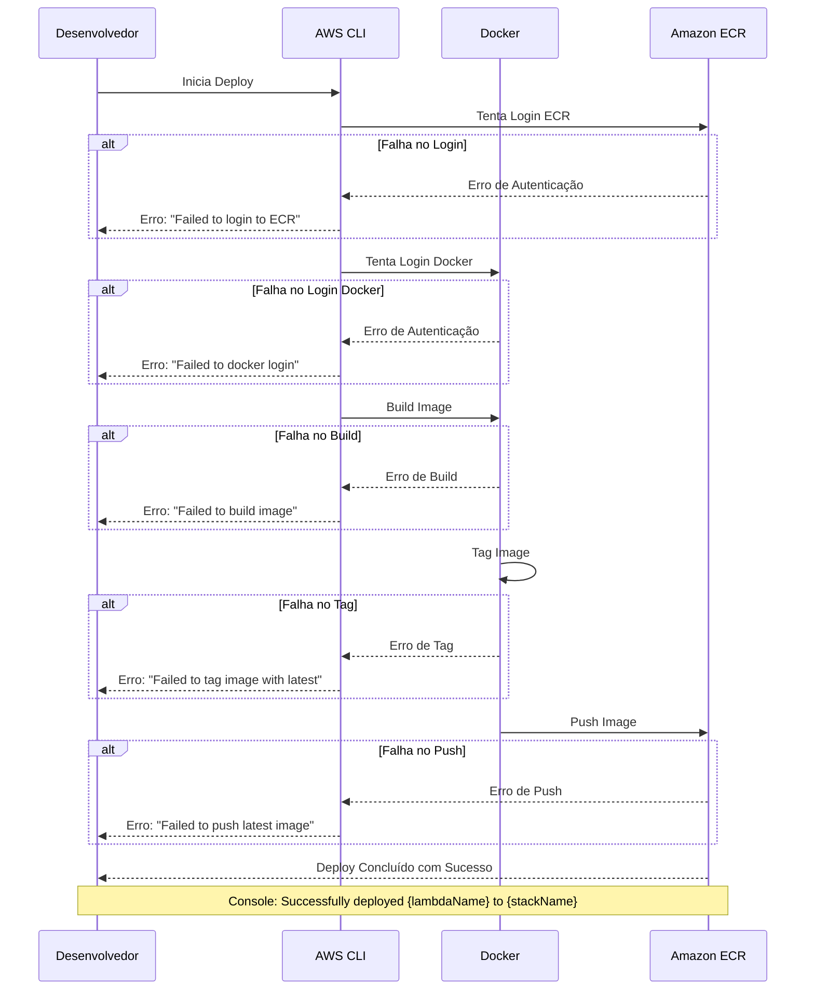
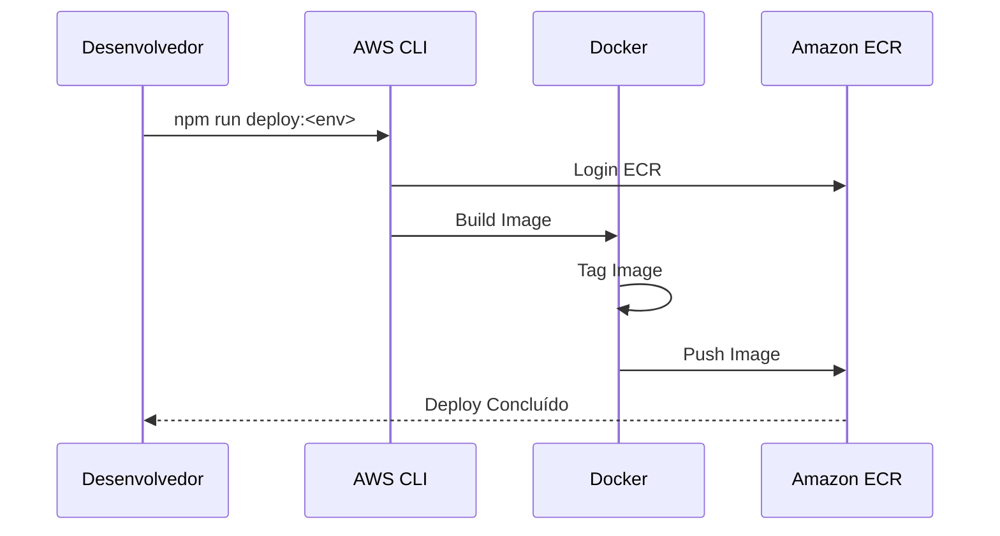

# EncantaLa Lambdas


Repositório para gerenciamento e deploy de funções AWS Lambda usando Docker e AWS CLI. As imagens são armazenadas no Amazon ECR (Elastic Container Registry).

## Deployments

### Main Branch

| Lambda Function     | Status                                                                                                                                                                                   |
| ------------------- | ---------------------------------------------------------------------------------------------------------------------------------------------------------------------------------------- |
| createAuthChallenge |  |
| defineAuthChallenge |  |
| executeRegistration |  |
| preRegister         |                  |
| verifyAuthChallenge |  |

### Staging Branch

| Lambda Function     | Status                                                                                                                                                                                         |
| ------------------- | ---------------------------------------------------------------------------------------------------------------------------------------------------------------------------------------------- |
| createAuthChallenge |  |
| defineAuthChallenge |  |
| executeRegistration |  |
| preRegister         |                  |
| verifyAuthChallenge |  |

### Develop Branch

| Lambda Function     | Status                                                                                                                                                                                         |
| ------------------- | ---------------------------------------------------------------------------------------------------------------------------------------------------------------------------------------------- |
| createAuthChallenge |  |
| defineAuthChallenge |  |
| executeRegistration |  |
| preRegister         |                  |
| verifyAuthChallenge |  |

## Configuração Inicial

## Configuração dos Hooks do Git

Antes de começar a trabalhar no repositório, execute o seguinte comando para configurar os hooks do Git:

```bash
npm run setup-hooks
```

### 1. Instalação de Dependências

Primeiro, instale as dependências do repositório principal:

```bash
npm install
```

Em seguida, instale as dependências de cada Lambda individualmente:

```bash
# Entre em cada diretório de Lambda e instale as dependências
cd src/lambdas/createAuthChallenge && npm install
cd src/lambdas/defineAuthChallenge && npm install
cd src/lambdas/executeRegistration && npm install
cd src/lambdas/preRegister && npm install
cd src/lambdas/verifyAuthChallenge && npm install
```

### 2. Configuração do Deploy

O arquivo `scripts/config/deployConfig.ts` permite configurar várias opções do processo de deploy:

```typescript
export const deployConfig = {
  // Número máximo de tentativas para comandos que falharem
  maxRetries: 3,

  // Timeout para execução de comandos (em milliseconds)
  timeout: 300000,

  // Se deve validar o status do Git antes do deploy
  validateGitStatus: true,

  // Se deve limpar imagens Docker antigas
  cleanupImages: true,

  // Se deve fazer backup das tags
  backupTags: true,

  // Se deve mostrar métricas de deploy
  metrics: true,
};
```

## Estrutura de Diretórios

```
PrimeLambdas/
├── .github/
├── node_modules/
├── src/
│ ├── lambdas/
│ │ ├── createAuthChallenge/
│ │ ├── defineAuthChallenge/
│ │ ├── executeRegistration/
│ │ ├── preRegister/
│ │ └── verifyAuthChallenge/
│ ├── scripts/
│ │ └── config/
│ │ ├── environments.ts
│ │ └── deploy-lambda.ts
│ ├── shared/
│ └── utils/
│ └── getRoot.ts
├── .gitignore
├── package-lock.json
├── package.json
├── README.md
└── tsconfig.json
```

## Fluxo de Deploy



## Processo de Build e Deploy



## Pré-requisitos

Antes de começar, certifique-se de ter instalado:

- Node.js e npm
- Docker
- AWS CLI
- TypeScript

## Configuração dos Perfis AWS CLI

É necessário configurar perfis AWS CLI para diferentes ambientes:

```bash
# Para configurar perfis, prefira o AWS SSO
aws configure sso

# Caso não tenha acesso ao AWS SSO, siga o procedimento abaixo

# Configurar Perfil de Desenvolvimento
aws configure --profile pgcdev
# Digite seu AWS Access Key ID
# Digite sua AWS Secret Access Key
# Digite a região padrão (ex: us-east-1)
# Digite o formato de saída (ex: json)

# Configurar Perfil de Produção
aws configure --profile pgcprod

# Configurar Perfil de Staging
aws configure --profile pgcstaging
```

## Scripts Disponíveis

O repositório inclui scripts de deploy para diferentes ambientes:

```bash
# Deploy em Desenvolvimento
npm run deploy:dev -- --lambda <nome-da-lambda>

# Deploy em Produção
npm run deploy:prod -- --lambda <nome-da-lambda>

# Deploy em Staging
npm run deploy:staging -- --lambda <nome-da-lambda>
```

**Importante**: Note o duplo traço (--) antes do parâmetro --lambda. Isso é necessário para o comando funcionar corretamente.

Exemplo:

```bash
npm run deploy:prod -- --lambda verifyAuthChallenge
```

## Estrutura do Projeto

### Lambdas

Cada função Lambda está contida em seu próprio diretório em `src/lambdas/` com:

- `package.json` individual
- `Dockerfile` customizado para build e deploy
- Código fonte e configuração específicos da função

### Recursos Compartilhados

O diretório `shared` contém código comum e utilitários usados em múltiplas funções Lambda.

### Scripts

O diretório `scripts` contém arquivos de deploy e configuração:

- `deploy-lambda.ts`: Script principal de deploy
- `environments.ts`: Configurações específicas de ambiente

## Desenvolvimento

1. Criar uma nova função Lambda:

   - Criar novo diretório em `src/lambdas/`
   - Inicializar com `package.json`
   - Criar `Dockerfile`
   - Implementar a função Lambda

2. Deploy da Lambda:
   ```bash
   npm run deploy:<ambiente> -- --lambda <nome-da-sua-lambda>
   ```

## Observações

- Certifique-se que o Docker esteja rodando antes de executar scripts de deploy
- Verifique se os perfis AWS CLI estão configurados corretamente
- Cada função Lambda deve ter um Dockerfile válido
- O diretório shared pode ser usado para código comum entre Lambdas
